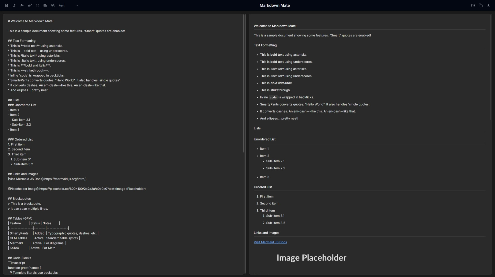

# Markdown Mate 🖋️

**A sleek, modern, and feature-rich web-based Markdown editor designed for a seamless writing and live-preview experience.**

Markdown Mate offers a distraction-free, dark-themed environment, allowing you to focus on your content while instantly seeing it rendered. It supports GitHub Flavored Markdown (GFM), mathematical expressions with KaTeX, and diagram creation with Mermaid.js.

*View the live demo [here](https://git-aarya.github.io/Markdown-Mate/)*

## Key Features ✨

* **✍️ Real-time Live Preview:** Instantly see your Markdown rendered as HTML as you type.
* **🌘 Elegant Dark Theme:** A clean, minimal design that's easy on the eyes, promoting focus.
* ** umfassendes GFM Support:** Full compatibility with GitHub Flavored Markdown, including:
    * Headings, bold, italics, strikethrough
    * Ordered and unordered lists (with smart list continuation)
    * Links and images
    * Code blocks with syntax highlighting (via Prism.js)
    * Blockquotes
    * Tables
* **📐 Mathematical Expressions:** Render LaTeX mathematical notation beautifully using KaTeX (e.g., `$E=mc^2$` or `$$\frac{a}{b}$$`).
* **📊 Diagram Rendering:** Create and embed flowcharts, sequence diagrams, class diagrams, and more using Mermaid.js syntax within `mermaid` code blocks.
* **💾 Local Auto-save:** Your work is automatically saved to your browser's local storage, preventing data loss.
* **📋 Copy HTML Output:** Easily copy the rendered HTML to your clipboard with a single click.
* **📁 Export Markdown:** Download your raw Markdown source text as a `.md` file.
* **🖱️ Synchronized Scrolling:** Smoothly scroll both the editor and preview panes in sync.
* **⌨️ Toolbar & Keyboard Shortcuts:** Quick-access toolbar buttons for common formatting actions (Bold, Italic, Link, Code, Quote, UML/Table Skeletons) and intuitive keyboard shortcuts (e.g., `Ctrl+B` for bold).
* **↔️ Smart Autopairing:** Automatic insertion of closing characters for `()`, `[]`, `{}`, `""`, `''`, and `` ``.
* **✒️ Font Customization:** Choose between Inter, Monospace, and Serif fonts for both the editor and preview areas.
* **❓ Integrated Help Modal:** A built-in guide explaining features and essential Markdown syntax.

## Getting Started

There are two primary ways to use Markdown Mate:

**1. Online (Recommended for quick use):**
   * Simply navigate to the live demo: [https://git-aarya.github.io/Markdown-Mate/](https://git-aarya.github.io/Markdown-Mate/)

**2. Local Usage (For offline use or modification):**
   1.  **Download:**
       * Clone the repository: `git clone https://github.com/git-aarya/Markdown-Mate.git`
       * Or download the `index.html`, `css/style.css`, and `js/script.js` files into a local directory.
   2.  **Open:** Open the `index.html` file directly in your preferred web browser (e.g., Chrome, Firefox, Edge, Safari).
   3.  **Use:** Start typing Markdown in the left pane, and the live preview will appear on the right.

## Technology Stack 🛠️

Markdown Mate is built with a focus on simplicity and modern web standards, utilizing client-side technologies:

* **HTML5:** For the core structure and content.
* **Tailwind CSS (via CDN):** For utility-first styling and a responsive design.
* **Vanilla JavaScript (ES6+):** For all application logic, interactivity, and DOM manipulation.
* **[Marked.js](https://marked.js.org/):** A fast and efficient Markdown parser.
* **[KaTeX](https://katex.org/):** The fastest math typesetting library for the web.
* **[Prism.js](https://prismjs.com/):** A lightweight, extensible syntax highlighter.
* **[Mermaid.js](https://mermaid.js.org/):** For generating diagrams and flowcharts from text in a Markdown-inspired syntax.

## How It Works

Markdown Mate processes your Markdown input in real-time:
1.  The text from the input area is passed to **Marked.js** for conversion to HTML.
2.  **Prism.js** then applies syntax highlighting to code blocks within the generated HTML.
3.  **KaTeX** scans the content for LaTeX expressions (delimited by `$` or `$$`) and renders them as mathematical formulas.
4.  **Mermaid.js** identifies `mermaid` code blocks and renders them as SVG diagrams.
5.  The resulting HTML is displayed in the preview pane.
6.  Features like auto-save, font selection, and toolbar actions are handled by custom JavaScript logic.

## Contributing

While this is a personal project, suggestions for improvements or bug fixes are welcome! Please feel free to open an issue on the GitHub repository.

## Use It Here [MarkdownMate](https://git-aarya.github.io/Markdown-Mate/)

